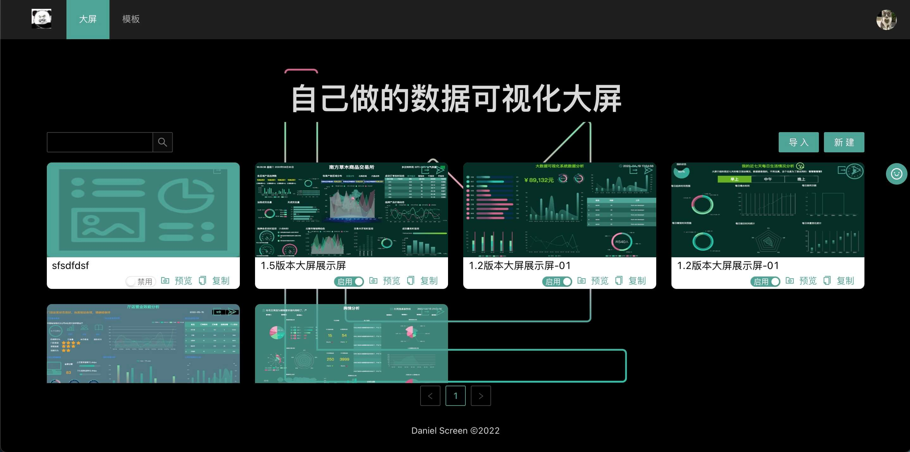
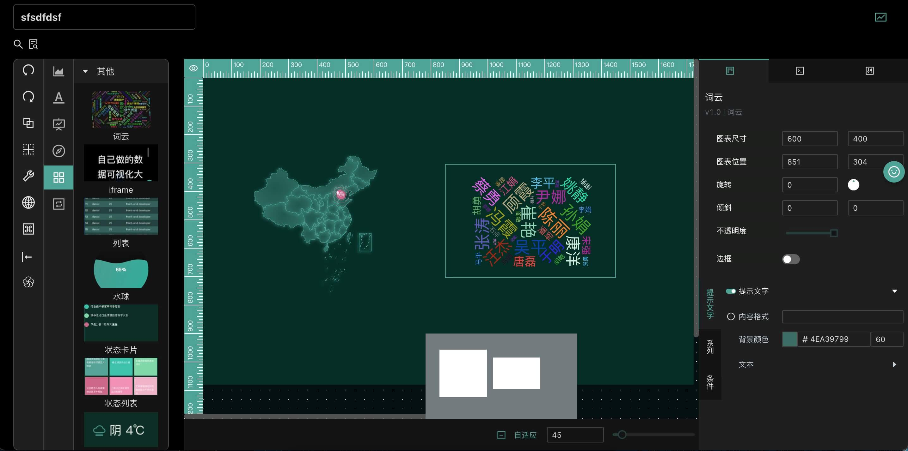
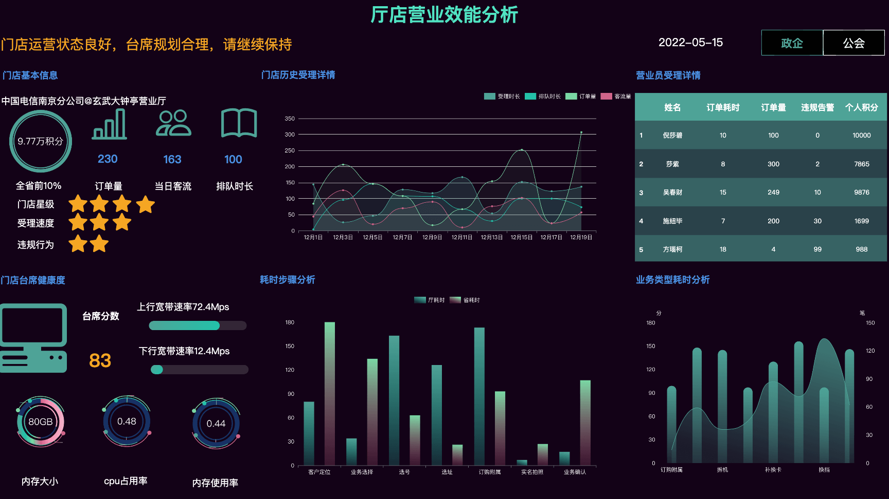
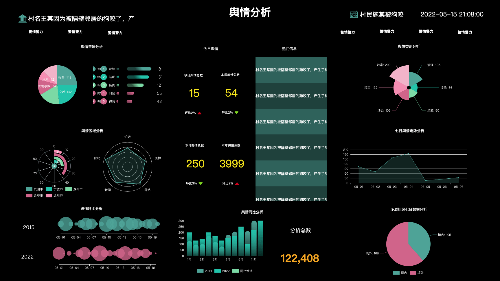

<!-- 关于开发当中的一些逻辑细节，存在了 /assets/development/attention 中 -->

<div align="center">
  
</div>

<br/>

<h1 align="center">🌛  数据可视化大屏  🌝 </h1>

<div align='center'>

一个基于[echarts](https://github.com/apache/echarts)数据可视化大屏设计器项目📈。

</div>

<div align="center">
支持<b>纯前端版本</b>和<b>完整交互版本</b>。
</div>

## 😈   当前版本(1.21) 

<br/>

## ✨  特性  

- 👁 可视化设计      
- 👾 丰富组件与物料  
- 🔧 简化设计  
- 📚 静态、API及Mock数据支持  
- 📌 快速预览以及外链分享链接  
- 👨‍👨‍👧‍👦 强大的交互能力  

## 🖥  截图

<div align="center">
  
  <br/>
  <br/>
  
  <br/>
  <br/>
  
  <br/>
  <br/>
  
  <br/>
  <br/>
  
</div>

## 🕷  本地调试

```sh
 $ git clone git@github.com:food-billboard/create-chart.git
 $ cd create-chart 
 $ yarn 
 $ yarn start # or yarn start:static (纯前端版本)
```

## 🙋‍♂️  问题反馈  

如有兴趣或有问题也可以在[issue](https://github.com/food-billboard/create-chart/issues)中联系我。     

## 👇🏻  Changelog  
[1.1](https://github.com/food-billboard/create-chart/blob/main/assets/docs/1.21.md)  
[1.20](https://github.com/food-billboard/create-chart/blob/main/assets/docs/1.20.md)  
[1.19](https://github.com/food-billboard/create-chart/blob/main/assets/docs/1.19.md)  
[1.18](https://github.com/food-billboard/create-chart/blob/main/assets/docs/1.18.md)   
[1.17](https://github.com/food-billboard/create-chart/blob/main/assets/docs/1.17.md)    
[1.16](https://github.com/food-billboard/create-chart/blob/main/assets/docs/1.16.md)   
[1.15](https://github.com/food-billboard/create-chart/blob/main/assets/docs/1.15.md)   
[1.14](https://github.com/food-billboard/create-chart/blob/main/assets/docs/1.14.md)   
[1.13](https://github.com/food-billboard/create-chart/blob/main/assets/docs/1.13.md)   
[1.12](https://github.com/food-billboard/create-chart/blob/main/assets/docs/1.12.md)  
[1.11](https://github.com/food-billboard/create-chart/blob/main/assets/docs/1.11.md)  
[1.10](https://github.com/food-billboard/create-chart/blob/main/assets/docs/1.10.md)  
[1.9](https://github.com/food-billboard/create-chart/blob/main/assets/docs/1.9.md)  
[1.8](https://github.com/food-billboard/create-chart/blob/main/assets/docs/1.8.md)  
[1.7](https://github.com/food-billboard/create-chart/blob/main/assets/docs/1.7.md)  
[1.6](https://github.com/food-billboard/create-chart/blob/main/assets/docs/1.6.md)  
[1.5](https://github.com/food-billboard/create-chart/blob/main/assets/docs/1.5.md)  
[1.4](https://github.com/food-billboard/create-chart/blob/main/assets/docs/1.4.md)  
[1.3](https://github.com/food-billboard/create-chart/blob/main/assets/docs/1.3.md)  
[1.2](https://github.com/food-billboard/create-chart/blob/main/assets/docs/1.2.md)  
[1.1](https://github.com/food-billboard/create-chart/blob/main/assets/docs/1.1.md)  
[1.0](https://github.com/food-billboard/create-chart/blob/main/assets/docs/1.0.md)  

## 🔗  链接  
[官网](http://47.97.27.23/api/backend/screen/index.html#/)  
[静态版本官网](https://food-billboard.github.io/create-chart/index.html#/) (访问速度可能很慢，请谅解)      
[操作文档](http://47.97.27.23/api/backend/create-chart-docs/index.html#/)  

## 👀  引用  
[一些边框和装饰的组件](https://github.com/DataV-Team/DataV)  
[图片主题色获取](https://github.com/lokesh/color-thief)   

## 🔚  说在后头  
目前版本稳定在`1.21`，已经过自己简单的测试，后续如有发现问题或者各位在使用过程中发现问题，都会尽量进行迭代处理。  